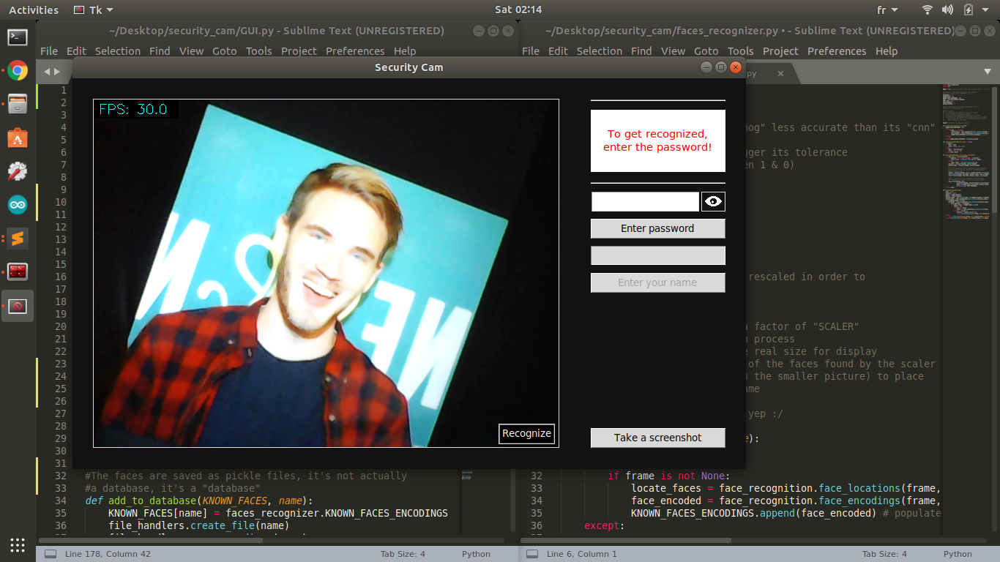

# Facial Recognition Desktop Application

>

---

## Description

This is a desktop app created with Python's built in library Tkinter.

It uses basic computer vision techniques to apply computer vision towards facial recognition.

### Key Words

- Python: OpenCV, face-recognition, Tkinter, OS, PIL.

- Computer Vision: facial recognition. 

---

## How to use

- Run the GUI.py file

- This interface will open:

